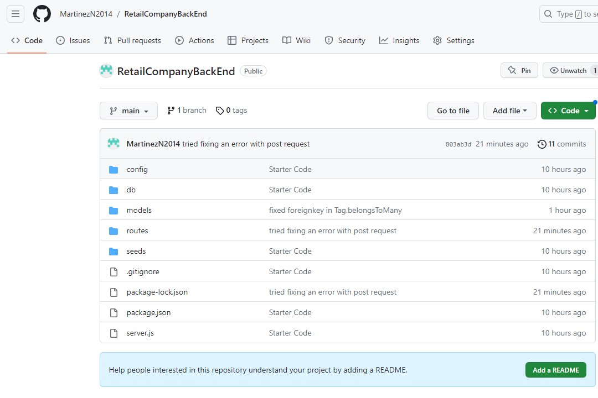

# Retail Company Back End Assignment

## Descryption

This app uses MySql, Sequelize, express, insomnia, and dotenv to create a Object-Relational Mapping E-Commerce back end for a retail company.

## Table of Contents

1. [Installation](#installation)
2. [Usage](#usage)
3. [Credits](#credits)
4. [License](#license)
5. [Features](#features)
6. [How to Contribute](#contribute)
7. [Test](#test)
8. [Questions](#questions)

## Installation

Clone it from my Repo

## Usage

Once all the packages have been install make sure to log into your mysql account and source the schema.sql and the seeds.sql. Then you can run "node server.js" to start your server. Then you will want to go into insomnia and load up the localhost:3001 with the correct api routes.

## Credits

https://shields.io/

## License

This application uses 

## Features

It uses express, Node.js, mysql2, sequelize, dotenv, and insomnia.

## How to Contribute

Contact me.

## Test

This does not have a test to run

## Questions

GitHub: [MartinezN2014](https://github.com/MartinezN2014/RetailCompanyBackEnd)
Email: [Email](2014nmartinez@gmail.com)

The youtube video of my project [link](https://www.youtube.com/watch?v=w8uNO1vsKJQ)
